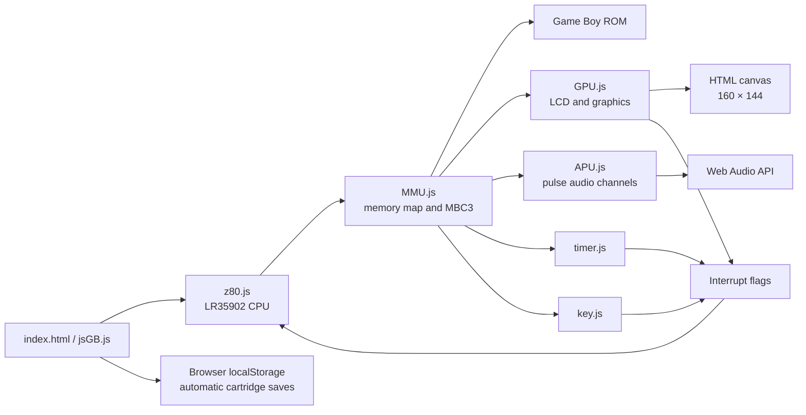
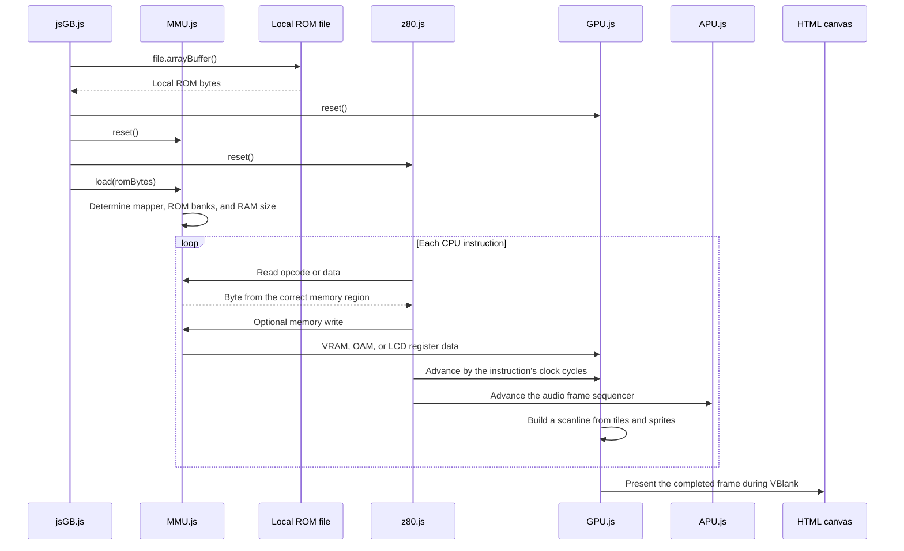

# Game Boy Emulator in JavaScript

This is an educational Game Boy emulator written in plain JavaScript. It runs directly in the browser and consists of separate components for the CPU, memory, graphics, timer, and input.

The project emulates the original Game Boy's Sharp LR35902 processor.

> ROM files must not be committed to the Git repository. Only use ROMs that you are legally allowed to access.

## Getting Started

### 1. Choose a ROM

Start the page and use the **ROM** file picker to select a local Game Boy ROM. The ROM is read directly from your computer and is not uploaded anywhere.

The repository does not require a `rom/` directory, and no ROM path is hardcoded in the source code.

The file picker currently accepts both `.gb` and `.gbc` extensions, but the emulator only implements original monochrome Game Boy (DMG) hardware. Game Boy Color-only games are not supported. A dual-mode `.gbc` ROM may only work if it can run in its DMG compatibility mode and uses a supported cartridge controller.

### 2. Start a Local Web Server

The local file picker does not require the ROM to be served over HTTP. However, using a local web server is still recommended for consistent browser behavior:

```bash
python3 -m http.server 8000
```

Then open:

```text
http://localhost:8000
```

Python is only used to serve the files over HTTP. The emulator itself is written in JavaScript.

### 3. Start the Emulator

After selecting a ROM, press **Run** to start and **Pause** to stop the execution loop. **Reset** resets the machine while keeping the selected ROM loaded.

## Controls

| Game Boy | Keyboard |
|---|---|
| D-pad | Arrow keys |
| A | `Z` |
| B | `X` |
| Start | `Enter` |
| Select | `Space` |

The on-screen D-pad, A, B, Start, and Select controls also work with a mouse or
touchscreen. Click the page first if keyboard input is not being detected.

The vertical **Volume** slider high on the console's left edge controls the
browser's master output level. Move it up or down to adjust the volume.
**Mute/Unmute** sits directly beside the slider and silences the emulator
without changing the selected volume. Both settings are remembered in browser storage.
Run/Pause and Reset are placed on the console, while ROM and save-file
management remains in the utility panel to its right. On narrow screens, the
utility panel moves below the console.

## Save Files

For cartridges that declare external RAM, save data is stored automatically in
the browser:

- When a game changes cartridge RAM, the emulator marks it for saving.
- Changed RAM is copied to `localStorage` while the emulator runs and when it is
  paused or the page is closed.
- Selecting the same ROM later restores its browser save automatically.
- A SHA-256 hash of the ROM identifies the save, so files with similar names do
  not share progress accidentally.

The ROM still has to be selected again after opening a new tab because browsers
do not allow a page to reopen arbitrary local files automatically.

The interface also provides manual backup controls:

- **Load Save:** imports a raw `.sav` file and immediately copies it to browser
  storage.
- **Download Save:** exports the current cartridge RAM as a local `.sav` file.
- **Delete Browser Save:** removes the stored progress for the selected ROM and
  starts it with empty cartridge RAM.

These controls remain disabled when the selected cartridge does not declare
external RAM. An imported file must have the exact RAM size declared by the
ROM's cartridge header. Loading a save pauses and resets the emulated machine so
the game can read the imported data from startup. Resetting the emulator
preserves cartridge RAM.

Both browser saves and downloaded `.sav` files contain raw cartridge RAM only.
MBC3 real-time clock state is not included. Browser saves belong to the current
site origin, so clearing browser site data or changing the host/port can make
them unavailable. Downloaded `.sav` files remain useful as portable backups.

## High-Level Architecture



The components communicate through global objects because the project does not use a bundler or module system.

### Division of Responsibilities

The architecture can roughly be divided into three layers:

1. **Control:** `index.html` and `jsGB.js` start, stop, and reset the emulator.
2. **Emulated hardware:** `z80.js`, `MMU.js`, `GPU.js`, `APU.js`,
   `timer.js`, and `key.js` imitate the hardware components of a Game Boy.
3. **Data and output:** The ROM contains the game program, the canvas displays
   the GPU image, and the Web Audio API plays the APU output.

The CPU is the active component that executes the game's instructions. The MMU connects the CPU to the rest of the machine. Whenever the CPU accesses a memory address, the MMU determines whether that address refers to ROM, RAM, graphics, the timer, input, or another I/O register.

## From ROM File to Image on the Screen

The following diagram shows the high-level workflow when a game is loaded and executed:



### 1. The ROM File Is Read

When the user chooses a file, `jsGB.loadROM()` reads it with the browser File API:

```javascript
var buffer = await file.arrayBuffer();
var romData = new Uint8Array(buffer);
jsGB._romData = romData;
```

The resulting bytes are stored in `jsGB._romData`. This allows Reset to restart the emulator without asking the user to select the file again.

### 2. The Machine Is Initialized

After reading a newly selected ROM, `jsGB.loadROM()` initializes the emulated hardware:

```javascript
GPU.reset();
MMU.reset();
Z80.reset();
```

The GPU, MMU, and CPU are given known initial values:

- The GPU clears video RAM, sprites, and the screen buffer.
- The MMU clears work RAM and I/O registers.
- The CPU receives initial register values, and the program counter is set to `0x0100`.

Address `0x0100` is the beginning of the cartridge program after a real Game Boy would normally have finished running its boot ROM.

### 3. The ROM Is Loaded into the MMU

After resetting the hardware, `jsGB.loadROM()` passes the selected bytes to the MMU:

```javascript
MMU.load(romData);
```

`MMU.load()` stores the byte array in `MMU._rom`, allowing the CPU to read program instructions and game data through the Game Boy address space.

Later presses of **Reset** do not call `MMU.load()` again. The selected ROM remains in memory, while CPU state, work RAM, video state, timers, and I/O are reset. Cartridge RAM is intentionally preserved.

The MMU also reads the cartridge header, including addresses `0x0147` and `0x0149`. The header describes the cartridge's memory controller, number of ROM banks, and amount of external RAM.

For an MBC3 cartridge, this allows the MMU to change which part of a large ROM is visible in the `4000–7FFF` address range.

### 4. The CPU Starts Running the Game

When the user presses **Run**, `jsGB.frame()` executes CPU instructions until approximately 70,224 clock cycles have passed.

For each instruction:

```javascript
Z80.exec();
```

The CPU uses the program counter to ask the MMU for the next opcode. The MMU determines which ROM bank contains the address and returns the correct byte. The CPU interprets the byte as an instruction and executes it.

### 5. The MMU Routes Memory Access

The game communicates with the emulated hardware by reading and writing specific addresses. The CPU does not access the components directly; it only uses `MMU.rb()` and `MMU.wb()`.

Examples:

- Writing to `8000–9FFF` updates video RAM.
- Writing to `FE00–FE9F` updates sprite data.
- Writing to `FF40–FF4B` changes LCD and GPU registers.
- Reading from `FF00` retrieves the current button state.
- Writing to `2000–3FFF` selects another ROM bank.

The MMU therefore acts as the central traffic controller for the emulator.

### 6. The GPU Builds the Image

A Game Boy frame is built gradually, one scanline at a time. After each CPU instruction, the GPU is told how many clock cycles that instruction consumed.

The GPU moves through four LCD phases:

1. Find the sprites that are visible on the current line.
2. Read tile and background data from VRAM.
3. Draw the current scanline.
4. Wait in HBlank before processing the next line.

When line 144 is reached, VBlank begins. The completed image is then copied to the HTML canvas:

```javascript
GPU._canvas.putImageData(GPU._scrn, 0, 0);
```

While the GPU is drawing a frame, the CPU continues executing the game's logic. Clock-cycle accounting keeps the two components running at approximately the same pace.

### 7. The Game Repeats the Loop

After VBlank, the GPU returns to the top of the screen. `jsGB.js` continues asking the CPU to run new frames approximately 60 times per second.

Keyboard input, timer events, and completed frames can set interrupt flags. The CPU responds by jumping to the game's interrupt handlers, which may update the game state or graphics.

## Startup Sequence

When the page has finished loading, `window.onload` in `jsGB.js` runs:

1. Handlers are connected to the ROM/save selectors and the **Load Save**,
   **Download Save**, **Delete Browser Save**, **Reset**, and **Run** buttons.
2. The page waits until the user selects a local ROM.
3. The browser reads the file into a `Uint8Array`.
4. `jsGB.loadROM()` calculates a hash that uniquely identifies the ROM.
5. `jsGB.loadROM()` resets the GPU, MMU, and CPU.
6. `jsGB.loadROM()` passes the ROM bytes to the MMU, which reads the cartridge header.
7. The mapper, ROM banks, and RAM size are configured.
8. If browser storage contains a matching save, it is copied into cartridge RAM.
9. The CPU is ready at address `0x0100`, as though the original boot ROM had already completed.

The boot ROM is therefore not emulated. CPU registers and selected hardware registers are initialized directly to the values the machine normally has after startup.

## Execution Loop

`jsGB.run()` starts a timer that runs at approximately 60 frames per second. It calls `jsGB.frame()` for each frame.

One Game Boy frame lasts approximately 70,224 clock cycles:

```javascript
var frameEnd = Z80._clock.t + 70224;

do {
    Z80.exec();
} while (Z80._clock.t < frameEnd);
```

For each instruction, `Z80.exec()`:

1. Checks for pending interrupts.
2. Reads the next opcode from the address in the program counter.
3. Executes the function associated with that opcode.
4. Updates CPU flags, the program counter, and the stack.
5. Adds the instruction's cycles to the global clock.
6. Advances the GPU and timer by the same number of cycles.

The CPU, GPU, and timer therefore remain synchronized through clock-cycle accounting.

## CPU – `z80.js`

The CPU core implements:

- All 256 primary LR35902 opcodes
- All 256 CB-prefixed opcodes
- 8-bit and 16-bit registers
- The `Z`, `N`, `H`, and `C` flags
- Stack operations, calls, and returns
- Conditional and unconditional jumps
- `HALT`, `STOP`, `DI`, `EI`, and delayed interrupt enabling
- Game Boy-specific instructions such as `DAA`

### Registers

The CPU registers are stored in `Z80._r`:

| Register | Purpose |
|---|---|
| `a` | Accumulator |
| `b`, `c`, `d`, `e`, `h`, `l` | General-purpose 8-bit registers |
| `f` | Flag register |
| `pc` | Program counter |
| `sp` | Stack pointer |
| `m`, `t` | Machine and clock cycles used by the latest instruction |
| `ime` | Global interrupt enable state |

The `BC`, `DE`, `HL`, and `AF` register pairs are built from their corresponding 8-bit registers.

### Opcode Tables

`Z80._map` contains the primary opcodes. `Z80._cbmap` contains the instructions that follow the `0xCB` prefix, including the `BIT`, `RES`, and `SET` bit operations.

The 11 byte values that are illegal on the Game Boy produce a clear error containing the opcode and address.

## Memory – `MMU.js`

MMU stands for Memory Management Unit. The CPU never accesses ROM, RAM, or the GPU directly. All memory access passes through:

```javascript
MMU.rb(address);         // Read one byte
MMU.wb(address, value);  // Write one byte
MMU.rw(address);         // Read a 16-bit value
MMU.ww(address, value);  // Write a 16-bit value
```

### Memory Map

| Address range | Contents |
|---|---|
| `0000–3FFF` | Fixed ROM bank |
| `4000–7FFF` | Switchable ROM bank |
| `8000–9FFF` | Video RAM |
| `A000–BFFF` | External cartridge RAM or RTC register |
| `C000–DFFF` | Work RAM |
| `E000–FDFF` | Work RAM mirror |
| `FE00–FE9F` | Sprite/OAM data |
| `FEA0–FEFF` | Unusable area |
| `FF00–FF7F` | I/O registers |
| `FF80–FFFE` | High RAM |
| `FFFF` | Interrupt Enable register |

### Cartridge Controllers

The project supports cartridges without a memory bank controller (`ROM ONLY`, `ROM+RAM`, and `ROM+RAM+BATTERY`) as well as MBC3 cartridge types.

MBC3 support includes:

- ROM bank switching
- External RAM enabling and bank switching
- Dynamic RAM sizing based on the cartridge header
- RTC registers for seconds, minutes, hours, and days
- RTC halt, carry, and latch behavior

RTC values are only kept in memory while the page is open.

### I/O

The MMU routes I/O addresses to the appropriate component:

- `FF00`: Joypad
- `FF01–FF02`: Serial communication
- `FF04–FF07`: Timer
- `FF0F`: Interrupt flags
- `FF40–FF4B`: LCD/GPU
- `FF46`: OAM DMA
- `FF50`: Boot ROM disable
- `FFFF`: Interrupt enable

Serial communication is implemented as a local stub: a transfer completes immediately without a link cable.

## Graphics – `GPU.js`

The GPU emulates the Game Boy LCD controller and renders to an HTML `canvas` at the original 160 × 144 pixel resolution.

It handles:

- The OAM, pixel transfer, HBlank, and VBlank LCD modes
- Background and window layers
- 8×8 and 8×16 sprites
- The `SCX` and `SCY` scroll registers
- The `WX` and `WY` window registers
- Background and sprite palettes
- Sprite priority and X/Y flipping
- `LY`, `LYC`, `LCDC`, and `STAT`
- VBlank and LCD STAT interrupts

### Tile Data

VRAM contains both tile data and tile maps. When the CPU writes tile data, `GPU.updatetile()` decodes the two bitplanes into color values between 0 and 3.

`GPU.renderscan()` draws one scanline at a time:

1. Find the correct background or window tile.
2. Read the pixel color from tile data.
3. Translate the color index through the appropriate palette.
4. Draw up to ten visible sprites over the scanline.
5. Present the completed image on the canvas during VBlank.

## Timer – `timer.js`

The timer contains the following Game Boy registers:

| Address | Register |
|---|---|
| `FF04` | `DIV` |
| `FF05` | `TIMA` |
| `FF06` | `TMA` |
| `FF07` | `TAC` |

`TIMER.inc()` is called after every CPU instruction. When an overflow occurs, `TMA` is copied into `TIMA`, and the MMU raises the timer interrupt.

## Audio – `APU.js`

The first audio implementation supports Game Boy pulse channels 1 and 2. Sound
register accesses from `FF10` through `FF3F` are routed by the MMU to the APU.
Pressing **Run** creates or resumes a browser `AudioContext`; pausing the
emulator suspends it.

The volume slider and mute button control a final Web Audio gain node after the
emulated channels have been mixed. They do not write to the Game Boy's sound
registers, so changing the browser volume cannot alter game behavior.

The implemented pulse-channel behavior includes:

- Channel triggering through `NR14` and `NR24`
- The four Game Boy duty-cycle settings
- The 11-bit period-to-frequency conversion
- Initial volume and volume envelopes
- Length counters
- Master volume and basic `NR51` output routing
- `NR52` APU power and channel status

The CPU advances the APU frame sequencer using the clock cycles consumed by each
instruction. Web Audio oscillators generate the final waveform. This is enough
for recognizable basic music and tones, but it is not yet a complete or
cycle-accurate Game Boy audio implementation.

The timer implementation works for the games tested during development, but it is not a fully cycle-accurate model of every hardware detail.

## Input – `key.js`

The Game Boy buttons are stored as two active-low four-bit rows:

- Action buttons: A, B, Select, and Start
- Direction buttons: Right, Left, Up, and Down

The MMU selects the appropriate row through the `FF00` joypad register. A new keypress raises the joypad interrupt flag.

## Interrupts

The Game Boy has five interrupt sources:

| Bit | Address | Source |
|---:|---:|---|
| 0 | `0040` | VBlank |
| 1 | `0048` | LCD STAT |
| 2 | `0050` | Timer |
| 3 | `0058` | Serial |
| 4 | `0060` | Joypad |

`MMU._if` indicates which interrupts are pending, while `MMU._ie` indicates which interrupts are enabled. If the CPU's `IME` flag is also enabled, the CPU stores the return address on the stack and jumps to the appropriate interrupt vector.

## Files

| File | Responsibility |
|---|---|
| `index.html` | User interface, ROM/save file pickers, canvas, and script loading |
| `jsGB.js` | Local ROM loading, automatic browser saves, `.sav` import/export, Reset, Run/Pause, and the frame loop |
| `z80.js` | LR35902 CPU and opcode tables |
| `MMU.js` | Memory map, cartridge banks, I/O, DMA, and RTC |
| `GPU.js` | LCD timing and rendering |
| `APU.js` | Pulse channels 1 and 2 and Web Audio output |
| `timer.js` | DIV/TIMA/TMA/TAC |
| `key.js` | Keyboard and joypad |
| `tests/z80.test.js` | CPU regression tests |
| `tests/mmu.test.js` | MMU, MBC3, and I/O tests |
| `tests/apu.test.js` | Pulse-channel register and timing tests |
| `tests/storage.test.js` | Automatic browser-save persistence tests |

## Tests

The tests require Node.js, but the emulator itself does not.

Run the CPU tests:

```bash
node tests/z80.test.js
```

Run the MMU tests:

```bash
node tests/mmu.test.js
```

Run the browser storage tests:

```bash
node tests/storage.test.js
```

Run the APU tests:

```bash
node tests/apu.test.js
```

Expected output:

```text
Z80 tests passed
MMU tests passed
Storage tests passed
APU tests passed
```

The tests cover:

- Opcode tables
- CPU flags and cycles
- Stack operations, calls, returns, and jumps
- The CB-prefixed `BIT`, `RES`, and `SET` instructions
- Delayed interrupt enabling
- ROM and RAM bank switching
- Echo RAM and 16-bit memory access
- Joypad, serial communication, and OAM DMA
- MBC3 RTC latching
- Cartridge RAM export, import, size validation, and preservation across Reset
- Automatic browser save encoding, storage, and restoration
- Pulse-channel triggering, length timing, volume, and APU power control
- Browser master volume, mute, and saved audio preferences

## Known Limitations

- Audio currently supports only pulse channels 1 and 2
- Channel 1 frequency sweep, wave channel 3, noise channel 4, and accurate
  stereo mixing are not implemented
- No Game Boy Color hardware support
- Only no-MBC and MBC3 cartridge types are supported
- No link cable or real serial communication
- MBC3 RTC state is not included in exported `.sav` files
- Browser saves depend on `localStorage` for the current site origin
- The boot ROM is not executed; the machine starts directly at `0x0100`
- The GPU and timer have not been tested against complete cycle-accuracy test ROMs
- Selected ROM data is only kept for the current browser tab

## Further Development

Natural next steps include:

1. Wave, noise, sweep, and more accurate audio mixing
2. More memory bank controllers, such as MBC1 and MBC5
3. MBC3 RTC persistence
4. Automated GPU and timer test ROMs
5. Drag-and-drop ROM loading

## Background

The project originally started from Imran Nazar's JavaScript Game Boy emulation series:

<https://imrannazar.com/series/gameboy-emulation-in-javascript>

Technical details have been checked against Pan Docs:

<https://gbdev.io/pandocs/>
