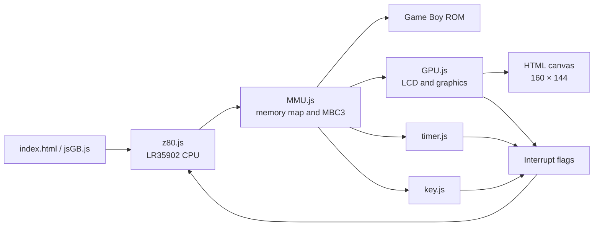
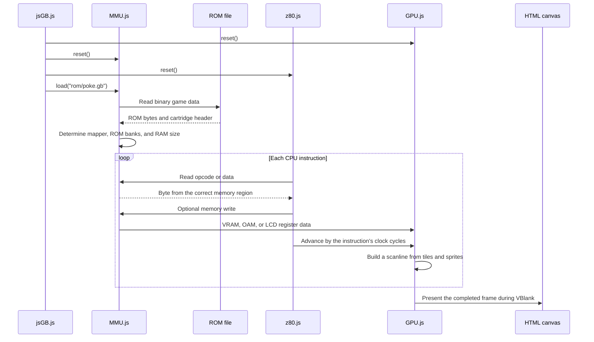

# Game Boy Emulator in JavaScript

This is an educational Game Boy emulator written in plain JavaScript. It runs directly in the browser and consists of separate components for the CPU, memory, graphics, timer, and input.

The project emulates the original Game Boy's Sharp LR35902 processor.

> ROM files must not be committed to the Git repository. Only use ROMs that you are legally allowed to access.

## Getting Started

### 1. Add a ROM

The default configuration expects the following file:

```text
rom/poke.gb
```

The ROM path can be changed in `jsGB.reset()`:

```javascript
MMU.load('rom/poke.gb');
```

### 2. Start a Local Web Server

The project cannot be opened directly through `file://`, because the browser prevents JavaScript from reading the ROM file. Start a local web server from the project directory:

```bash
python3 -m http.server 8000
```

Then open:

```text
http://localhost:8000
```

Python is only used to serve the files over HTTP. The emulator itself is written in JavaScript.

### 3. Start the Emulator

Press **Run** to start and **Pause** to stop the execution loop. **Reset** resets the machine and reloads the ROM.

If the browser shows an older version after a code change, use:

```text
Ctrl+Shift+R
```

## Controls

| Game Boy | Keyboard |
|---|---|
| D-pad | Arrow keys |
| A | `Z` |
| B | `X` |
| Start | `Enter` |
| Select | `Space` |

Click the page first if keyboard input is not being detected.

## High-Level Architecture



The components communicate through global objects because the project does not use a bundler or module system.

### Division of Responsibilities

The architecture can roughly be divided into three layers:

1. **Control:** `index.html` and `jsGB.js` start, stop, and reset the emulator.
2. **Emulated hardware:** `z80.js`, `MMU.js`, `GPU.js`, `timer.js`, and `key.js` imitate the hardware components of a Game Boy.
3. **Data and display:** The ROM file contains the game program, while the HTML canvas displays the image produced by the GPU.

The CPU is the active component that executes the game's instructions. The MMU connects the CPU to the rest of the machine. Whenever the CPU accesses a memory address, the MMU determines whether that address refers to ROM, RAM, graphics, the timer, input, or another I/O register.

## From ROM File to Image on the Screen

The following diagram shows the high-level workflow when a game is loaded and executed:



### 1. The Machine Is Reset

`jsGB.reset()` begins by resetting the emulated hardware:

```javascript
GPU.reset();
MMU.reset();
Z80.reset();
```

The GPU, MMU, and CPU are given known initial values:

- The GPU clears video RAM, sprites, and the screen buffer.
- The MMU clears work RAM and I/O registers.
- The CPU receives initial register values, and the program counter is set to `0x0100`.

Address `0x0100` is the beginning of the cartridge program after a real Game Boy would normally have finished running its boot ROM.

### 2. The ROM Is Loaded

`jsGB.reset()` then calls:

```javascript
MMU.load('rom/poke.gb');
```

`MMU.load()` uses `BinFileReader` to read the entire `.gb` file. Its contents are stored in `MMU._rom`, allowing the CPU to read program instructions and game data through the Game Boy address space.

The MMU also reads the cartridge header, including addresses `0x0147` and `0x0149`. The header describes the cartridge's memory controller, number of ROM banks, and amount of external RAM.

For an MBC3 cartridge, this allows the MMU to change which part of a large ROM is visible in the `4000–7FFF` address range.

### 3. The CPU Starts Running the Game

When the user presses **Run**, `jsGB.frame()` executes CPU instructions until approximately 70,224 clock cycles have passed.

For each instruction:

```javascript
Z80.exec();
```

The CPU uses the program counter to ask the MMU for the next opcode. The MMU determines which ROM bank contains the address and returns the correct byte. The CPU interprets the byte as an instruction and executes it.

### 4. The MMU Routes Memory Access

The game communicates with the emulated hardware by reading and writing specific addresses. The CPU does not access the components directly; it only uses `MMU.rb()` and `MMU.wb()`.

Examples:

- Writing to `8000–9FFF` updates video RAM.
- Writing to `FE00–FE9F` updates sprite data.
- Writing to `FF40–FF4B` changes LCD and GPU registers.
- Reading from `FF00` retrieves the current button state.
- Writing to `2000–3FFF` selects another ROM bank.

The MMU therefore acts as the central traffic controller for the emulator.

### 5. The GPU Builds the Image

A Game Boy frame is built gradually, one scanline at a time. After each CPU instruction, the GPU is told how many clock cycles that instruction consumed.

The GPU moves through four LCD phases:

1. Find the sprites that are visible on the current line.
2. Read tile and background data from VRAM.
3. Draw the current scanline.
4. Wait in HBlank before processing the next line.

When line 144 is reached, VBlank begins. The completed image is then copied to the HTML canvas:

```javascript
GPU._canvas.putImageData(GPU._scrn, 0, 0);
```

While the GPU is drawing a frame, the CPU continues executing the game's logic. Clock-cycle accounting keeps the two components running at approximately the same pace.

### 6. The Game Repeats the Loop

After VBlank, the GPU returns to the top of the screen. `jsGB.js` continues asking the CPU to run new frames approximately 60 times per second.

Keyboard input, timer events, and completed frames can set interrupt flags. The CPU responds by jumping to the game's interrupt handlers, which may update the game state or graphics.

## Startup Sequence

When the page has finished loading, `window.onload` in `jsGB.js` runs:

1. Click handlers are connected to **Reset** and **Run**.
2. `jsGB.reset()` resets the GPU, MMU, and CPU.
3. The MMU loads the ROM file.
4. The cartridge header is read to determine the mapper, ROM banks, and RAM size.
5. The CPU starts at address `0x0100`, as though the original boot ROM had already completed.

The boot ROM is therefore not emulated. CPU registers and selected hardware registers are initialized directly to the values the machine normally has after startup.

## Execution Loop

`jsGB.run()` starts a timer that runs at approximately 60 frames per second. It calls `jsGB.frame()` for each frame.

One Game Boy frame lasts approximately 70,224 clock cycles:

```javascript
var frameEnd = Z80._clock.t + 70224;

do {
    Z80.exec();
} while (Z80._clock.t < frameEnd);
```

For each instruction, `Z80.exec()`:

1. Checks for pending interrupts.
2. Reads the next opcode from the address in the program counter.
3. Executes the function associated with that opcode.
4. Updates CPU flags, the program counter, and the stack.
5. Adds the instruction's cycles to the global clock.
6. Advances the GPU and timer by the same number of cycles.

The CPU, GPU, and timer therefore remain synchronized through clock-cycle accounting.

## CPU – `z80.js`

The CPU core implements:

- All 256 primary LR35902 opcodes
- All 256 CB-prefixed opcodes
- 8-bit and 16-bit registers
- The `Z`, `N`, `H`, and `C` flags
- Stack operations, calls, and returns
- Conditional and unconditional jumps
- `HALT`, `STOP`, `DI`, `EI`, and delayed interrupt enabling
- Game Boy-specific instructions such as `DAA`

### Registers

The CPU registers are stored in `Z80._r`:

| Register | Purpose |
|---|---|
| `a` | Accumulator |
| `b`, `c`, `d`, `e`, `h`, `l` | General-purpose 8-bit registers |
| `f` | Flag register |
| `pc` | Program counter |
| `sp` | Stack pointer |
| `m`, `t` | Machine and clock cycles used by the latest instruction |
| `ime` | Global interrupt enable state |

The `BC`, `DE`, `HL`, and `AF` register pairs are built from their corresponding 8-bit registers.

### Opcode Tables

`Z80._map` contains the primary opcodes. `Z80._cbmap` contains the instructions that follow the `0xCB` prefix, including the `BIT`, `RES`, and `SET` bit operations.

The 11 byte values that are illegal on the Game Boy produce a clear error containing the opcode and address.

## Memory – `MMU.js`

MMU stands for Memory Management Unit. The CPU never accesses ROM, RAM, or the GPU directly. All memory access passes through:

```javascript
MMU.rb(address);         // Read one byte
MMU.wb(address, value);  // Write one byte
MMU.rw(address);         // Read a 16-bit value
MMU.ww(address, value);  // Write a 16-bit value
```

### Memory Map

| Address range | Contents |
|---|---|
| `0000–3FFF` | Fixed ROM bank |
| `4000–7FFF` | Switchable ROM bank |
| `8000–9FFF` | Video RAM |
| `A000–BFFF` | External cartridge RAM or RTC register |
| `C000–DFFF` | Work RAM |
| `E000–FDFF` | Work RAM mirror |
| `FE00–FE9F` | Sprite/OAM data |
| `FEA0–FEFF` | Unusable area |
| `FF00–FF7F` | I/O registers |
| `FF80–FFFE` | High RAM |
| `FFFF` | Interrupt Enable register |

### MBC3

The project supports ROM-only cartridges and MBC3, which is used by the current test ROM.

MBC3 support includes:

- ROM bank switching
- External RAM enabling and bank switching
- Dynamic RAM sizing based on the cartridge header
- RTC registers for seconds, minutes, hours, and days
- RTC halt, carry, and latch behavior

RTC values are only kept in memory while the page is open.

### I/O

The MMU routes I/O addresses to the appropriate component:

- `FF00`: Joypad
- `FF01–FF02`: Serial communication
- `FF04–FF07`: Timer
- `FF0F`: Interrupt flags
- `FF40–FF4B`: LCD/GPU
- `FF46`: OAM DMA
- `FF50`: Boot ROM disable
- `FFFF`: Interrupt enable

Serial communication is implemented as a local stub: a transfer completes immediately without a link cable.

## Graphics – `GPU.js`

The GPU emulates the Game Boy LCD controller and renders to an HTML `canvas` at the original 160 × 144 pixel resolution.

It handles:

- The OAM, pixel transfer, HBlank, and VBlank LCD modes
- Background and window layers
- 8×8 and 8×16 sprites
- The `SCX` and `SCY` scroll registers
- The `WX` and `WY` window registers
- Background and sprite palettes
- Sprite priority and X/Y flipping
- `LY`, `LYC`, `LCDC`, and `STAT`
- VBlank and LCD STAT interrupts

### Tile Data

VRAM contains both tile data and tile maps. When the CPU writes tile data, `GPU.updatetile()` decodes the two bitplanes into color values between 0 and 3.

`GPU.renderscan()` draws one scanline at a time:

1. Find the correct background or window tile.
2. Read the pixel color from tile data.
3. Translate the color index through the appropriate palette.
4. Draw up to ten visible sprites over the scanline.
5. Present the completed image on the canvas during VBlank.

## Timer – `timer.js`

The timer contains the following Game Boy registers:

| Address | Register |
|---|---|
| `FF04` | `DIV` |
| `FF05` | `TIMA` |
| `FF06` | `TMA` |
| `FF07` | `TAC` |

`TIMER.inc()` is called after every CPU instruction. When an overflow occurs, `TMA` is copied into `TIMA`, and the MMU raises the timer interrupt.

The timer implementation works for the project's ROM, but it is not a fully cycle-accurate model of every hardware detail.

## Input – `key.js`

The Game Boy buttons are stored as two active-low four-bit rows:

- Action buttons: A, B, Select, and Start
- Direction buttons: Right, Left, Up, and Down

The MMU selects the appropriate row through the `FF00` joypad register. A new keypress raises the joypad interrupt flag.

## Interrupts

The Game Boy has five interrupt sources:

| Bit | Address | Source |
|---:|---:|---|
| 0 | `0040` | VBlank |
| 1 | `0048` | LCD STAT |
| 2 | `0050` | Timer |
| 3 | `0058` | Serial |
| 4 | `0060` | Joypad |

`MMU._if` indicates which interrupts are pending, while `MMU._ie` indicates which interrupts are enabled. If the CPU's `IME` flag is also enabled, the CPU stores the return address on the stack and jumps to the appropriate interrupt vector.

## Files

| File | Responsibility |
|---|---|
| `index.html` | User interface, canvas, and script loading |
| `jsGB.js` | Reset, Run/Pause, and the frame loop |
| `z80.js` | LR35902 CPU and opcode tables |
| `MMU.js` | Memory map, cartridge banks, I/O, DMA, and RTC |
| `GPU.js` | LCD timing and rendering |
| `timer.js` | DIV/TIMA/TMA/TAC |
| `key.js` | Keyboard and joypad |
| `fileread.js` | Reads binary ROM files over HTTP |
| `tests/z80.test.js` | CPU regression tests |
| `tests/mmu.test.js` | MMU, MBC3, and I/O tests |

## Tests

The tests require Node.js, but the emulator itself does not.

Run the CPU tests:

```bash
node tests/z80.test.js
```

Run the MMU tests:

```bash
node tests/mmu.test.js
```

Expected output:

```text
Z80 tests passed
MMU tests passed
```

The tests cover:

- Opcode tables
- CPU flags and cycles
- Stack operations, calls, returns, and jumps
- The CB-prefixed `BIT`, `RES`, and `SET` instructions
- Delayed interrupt enabling
- ROM and RAM bank switching
- Echo RAM and 16-bit memory access
- Joypad, serial communication, and OAM DMA
- MBC3 RTC latching

## Known Limitations

- No audio/APU
- Only ROM-only and MBC3 cartridge types are supported
- No link cable or real serial communication
- Save RAM and RTC state are not persisted in the browser
- The boot ROM is not executed; the machine starts directly at `0x0100`
- The GPU and timer have not been tested against complete cycle-accuracy test ROMs
- The ROM path is currently hardcoded in `jsGB.js`
- `fileread.js` uses synchronous `XMLHttpRequest`, which is an older browser technique

## Further Development

Natural next steps include:

1. Persistent save files using `localStorage`
2. A ROM selector in the user interface
3. Audio/APU support
4. More memory bank controllers, such as MBC1 and MBC5
5. Automated GPU and timer test ROMs
6. Replace synchronous ROM loading with `fetch()` and `ArrayBuffer`

## Background

The project originally started from Imran Nazar's JavaScript Game Boy emulation series:

<https://imrannazar.com/series/gameboy-emulation-in-javascript>

Technical details have been checked against Pan Docs:

<https://gbdev.io/pandocs/>
